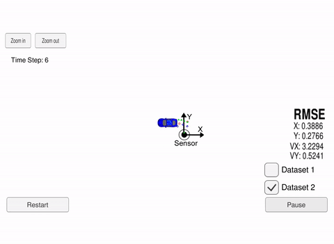
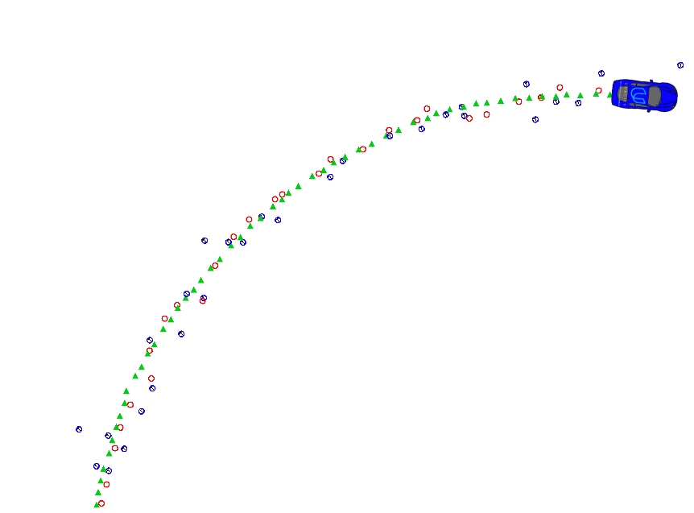

# Extended Kalman Filter

*This repository implements an extended kalman filter used to track a simulated car, fusing lidar and radar sensor information.*

 

## Building

Install dependencies. 
1. Clone this repo.
2. make buld directory `mkdir build && cd build`
3. compile `cmake .. && make` 
   * On windows, you may need to run: `cmake .. -G "Unix Makefiles" && make`

## Run

1. Download the [simulator](https://github.com/udacity/self-driving-car-sim/releases "Simulator Link Download"). 

2. Start: `./ExtendedKF `

3. Run the simulator.

## Dependencies

* uWebSocketIO: Install using **install-linux.sh** or **install-mac.sh**. Also works for windows, but needs some fixes.  
* cmake >= 3.5
  * All OSes: [click here for installation instructions](https://cmake.org/install/)
* make >= 4.1 (Linux, Mac), 3.81 (Windows)
  * Linux: make is installed by default on most Linux distros
  * Mac: [install Xcode command line tools to get make](https://developer.apple.com/xcode/features/)
  * Windows: [Click here for installation instructions](http://gnuwin32.sourceforge.net/packages/make.htm)
* gcc/g++ >= 5.4
  * Linux: gcc / g++ is installed by default on most Linux distros
  * Mac: same deal as make - [install Xcode command line tools](https://developer.apple.com/xcode/features/)
  * Windows: recommend using [MinGW](http://www.mingw.org/)

## How it works

The program simulates a moving car, using the car position groundtruth. **Red** and **blue** dots represent (lidar and laser) measurements of the car. The **green triangles** are the car location estimation given by the kalman filter. 

The simulation data used is inside of "data/obj_pose-laser-radar-synthetic-input.txt". Each row represents one measurement from either Lidar or Radar. Each column represents, in order: (for radar) `sensor_type, rho_measured, phi_measured, rhodot_measured, timestamp, x_groundtruth, y_groundtruth, vx_groundtruth, vy_groundtruth, yaw_groundtruth, yawrate_groundtruth` ; or (for lidar) `sensor_type, x_measured, y_measured, timestamp, x_groundtruth, y_groundtruth, vx_groundtruth, vy_groundtruth, yaw_groundtruth, yawrate_groundtruth` .

In the case of the radar, measurements are in polar form, so converting to state vector space (cartesian space) is a non-linear operation. Thus, an extended kalman filter is used, where the measurement funcion is linearized with Taylor series expansion for a multivariable function, which implies calculating the Jacobian matrix. 

## Code & Classes

**FusionEKF** handles the measurements callbacks from the main program loop. It initializes the filter on the first call, and then operates on a *predit* to *measurement update* cycle on every subsequent call. It also updates the process covariance matrix and the Jacobian matrix of the filter before calling the methods. 

**KalmanFilter** implements the main filter functions, namely: *Predict()*, *Update()* and *UpdateEKF()*. Based on time elapsed and new measurement readings, they guess and update the new most likely position of the object being tracked, using the standard kalman filter equations. For the Extended update case, it projects the object position onto the measurement space using the non-linear equation.
