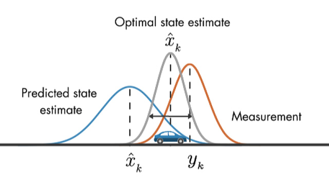

# Extended Kalman Filter

This repository implements an extended kalman filter used to track a moving object, fusing lidar and radar sensor information. 

## Building

Install dependencies. 
1. Clone this repo.
2. make buld directory `mkdir build && cd build`
3. compile `cmake .. && make` 
   * On windows, you may need to run: `cmake .. -G "Unix Makefiles" && make`

## Run

Download the [simulator](https://github.com/udacity/self-driving-car-sim/releases "Simulator Link Download"). 

Start: `./ExtendedKF `
Run the simulator.

## Dependencies

* uWebSocketIO: Install using **install-linux.sh** or **install-mac.sh**. Also works for windows, but needs some fixes.  
* cmake >= 3.5
  * All OSes: [click here for installation instructions](https://cmake.org/install/)
* make >= 4.1 (Linux, Mac), 3.81 (Windows)
  * Linux: make is installed by default on most Linux distros
  * Mac: [install Xcode command line tools to get make](https://developer.apple.com/xcode/features/)
  * Windows: [Click here for installation instructions](http://gnuwin32.sourceforge.net/packages/make.htm)
* gcc/g++ >= 5.4
  * Linux: gcc / g++ is installed by default on most Linux distros
  * Mac: same deal as make - [install Xcode command line tools](https://developer.apple.com/xcode/features/)
  * Windows: recommend using [MinGW](http://www.mingw.org/)

Tips for setting up your environment can be found in the classroom lesson for this project.

Note that the programs that need to be written to accomplish the project are src/FusionEKF.cpp, src/FusionEKF.h, kalman_filter.cpp, kalman_filter.h, tools.cpp, and tools.h

The program main.cpp has already been filled out, but feel free to modify it.

Here is the main protocol that main.cpp uses for uWebSocketIO in communicating with the simulator.

INPUT: values provided by the simulator to the c++ program

["sensor_measurement"] => the measurement that the simulator observed (either lidar or radar)

OUTPUT: values provided by the c++ program to the simulator

["estimate_x"] <= kalman filter estimated position x
["estimate_y"] <= kalman filter estimated position y
["rmse_x"]
["rmse_y"]
["rmse_vx"]
["rmse_vy"]

---